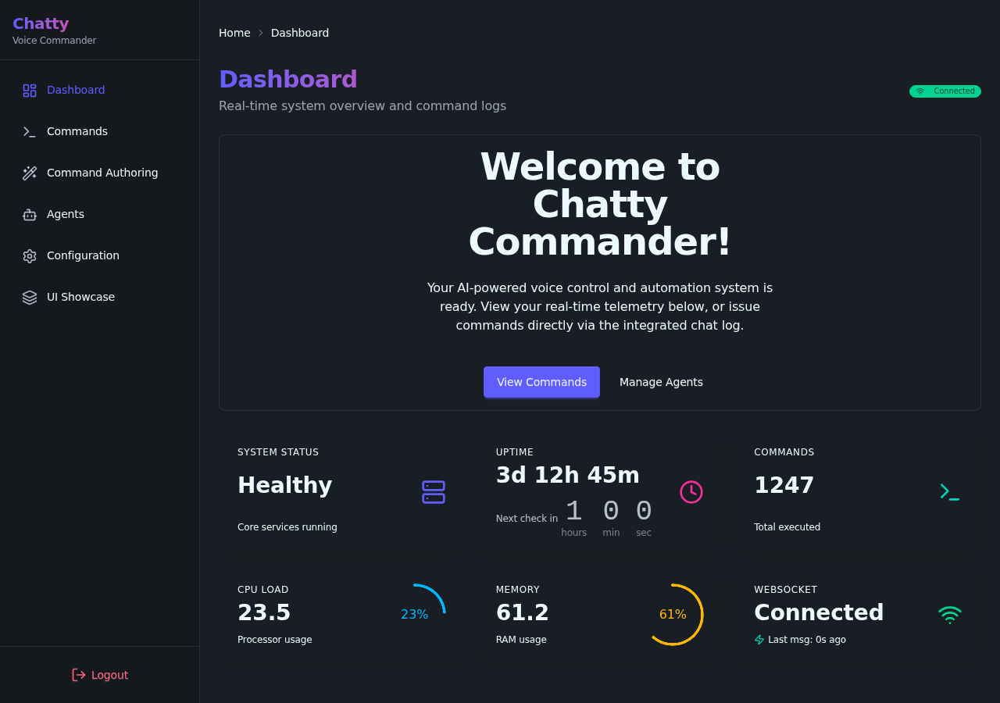

# ChattyCommander

**Vision:** A reliable, local-first, extensible voice automation platform. Speak a wake word → reliable actions (keypresses, URLs, shells, or voice calls). First-class web UI for everything. Self-hostable, pluggable backends, LLM advisors for power users.

See [docs/developer/ARCHITECTURE.md](docs/developer/ARCHITECTURE.md) (Vision front-and-center + honest current state + [Archived/Legacy Architectures](docs/developer/ARCHITECTURE.md#legacy-and-archived-architectures) section) and the [Roadmap](ROADMAP.md).

A local-first voice assistant that turns wake words into actions. Say a trigger word, and ChattyCommander fires keypresses, opens URLs, runs system commands, or places a voice call — with a FastAPI backend, a React web dashboard, a CLI, and optional LLM "advisor" agents.



**Take the [Guided Tour](docs/user-guide/00_GUIDED_TOUR.md)** — a screenshot walkthrough of the full user story, from login to firing your first command.

## What works today

| Feature | Status | Notes |
|---------|--------|-------|
| Wake-word detection | ✅ Stable | OpenWakeWord ONNX models, state-driven loading (`idle`/`chatty`/`computer`) |
| Voice transcription & TTS | ✅ Stable | Whisper-based transcription with pluggable backends; TTS via offline `pyttsx3` (default) or optional Microsoft Edge neural voices — keyless/free but network-required (`pip install 'chatty-commander[tts-edge]'`, then `backend="edge"`) |
| Command execution | ✅ Stable | Config-defined actions: keypress, URL, system command, voice call |
| Web dashboard | ✅ Stable | React + DaisyUI: dashboard, configuration, command authoring, themes, audio settings, and a dry-run Voice Test page |
| Web API | ✅ Stable | FastAPI with `X-API-Key` auth middleware, WebSocket state push, standardized error envelopes, OpenAPI docs |
| CLI | ✅ Stable | `chatty-commander` console script with subcommands (`dograh`, config, modes) |
| LLM advisors | ✅ Stable | OpenAI/Ollama-backed agents with tools (browser analyst, mode switch, voice call) |
| dograh voice calls | ✅ Optional | Self-hosted call-workflow engine via compose overlay (see below) |
| Desktop GUI / avatar | 🚧 Partial | PyQt5 tray + avatar visualization exist but are unfinished — see roadmap |
| Discord/Slack bridges | 🚧 Partial | Orchestrator constructs the advisor sink and routes messages; the external bridge client process is not yet maintained in-repo |

Test suite: 1,100+ Python tests green on `main`, plus a frontend unit suite (vitest) and Playwright e2e; production build verified in CI.

## Getting started

Requires Python 3.11+ (and Node.js 18+ only if you want to develop the frontend).

```bash
git clone https://github.com/matthewhand/chatty-commander.git
cd chatty-commander
uv sync                      # install the chatty-commander package and dependencies
cp config.json.example config.json
uv run chatty-commander      # launches the CLI entry point
```

To run the web dashboard locally:

```bash
uv run chatty-commander --web --no-auth   # dev mode; --no-auth is for local use only
```

Then follow the docs:

- [Guided Tour (screenshots)](docs/user-guide/00_GUIDED_TOUR.md) — see every page before installing
- [User Guide](docs/user-guide/USER_GUIDE.md) — installation, configuration, dashboard, voice modes & commands

## Optional: dograh voice-call integration

ChattyCommander can drive [dograh](https://github.com/dograh-tech/dograh), a self-hosted voice-call workflow engine, to place and manage phone/web calls.

- **Enable the stack**: run the dograh services alongside ChattyCommander via the compose overlay:
  ```bash
  COMPOSE_FILE=docker-compose.yml:docker-compose.dograh.yml docker compose up -d
  ```
- **Configure**: copy `.env.example` to `.env` and fill in the dograh block (`DOGRAH_BASE_URL`, `DOGRAH_API_KEY`). The `scripts/seed_dograh.py` helper can bootstrap a user, API key, and workflow for you (`--output FILE` keeps the key out of your terminal).
- **CLI**: `chatty-commander dograh health`, `... dograh list`, and `... dograh call WORKFLOW_ID PHONE_NUMBER` cover the common operations.
- **Web UI**: the dashboard shows a dograh status card with reachability and version info.

The integration is entirely optional — without dograh configured, the rest of ChattyCommander works as usual.

## Developer documentation

Looking to modify the core functionality or add new LLM adapters?
Check out the [Developer Docs](docs/developer/), [FEATURE_STATUS.md](FEATURE_STATUS.md) (evidence-based feature audit), and [CONTRIBUTING.md](CONTRIBUTING.md).

## Contributing & security

- [CONTRIBUTING.md](CONTRIBUTING.md) — dev setup, code style, and PR conventions
- [CODE_OF_CONDUCT.md](CODE_OF_CONDUCT.md) — community standards
- [SECURITY.md](SECURITY.md) — how to report vulnerabilities

## Roadmap: unfinished features

The canonical tiered checklist lives in [`ROADMAP.md`](ROADMAP.md). The headline unfinished items:

- [ ] **Desktop GUI (PyQt5 tray + avatar)** — `gui/` and avatar code exist (~390-line tray app, thinking-state WebSocket) but there is no finished renderer or packaging; the web dashboard is the supported UI for now.
- [ ] **Discord/Slack bridges** — the orchestrator's `DiscordBridgeAdapter` now delivers messages to an advisor sink, but:
  - [ ] CLI entry points still pass `advisor_sink=None` (`cli/cli.py`, `cli/main.py`) — construct an `AdvisorsService` when `--advisors` is enabled
  - [ ] the external bridge process (Discord/Slack client) needs a maintained implementation
- [ ] **dograh end-to-end calling** — integration is hardened, but completing a real call needs user-side setup:
  - [ ] author a telephony workflow in dograh's UI
  - [ ] configure a Twilio/Vonage provider (or self-hosted LLM/STT/TTS for browser calls)
- [ ] **Frontend unit tests** — only Playwright e2e exists; vitest is present but unconfigured (no `test` script, jsdom missing)
- [ ] **`llm/` module consolidation** — ~1,400 lines, partially consumed; merge with `advisors/` providers or trim
- [ ] **Phase 2: WebRTC audio bridge** — share one audio stream between wake-word detection and dograh calls
- [ ] **Phase 3: UI consolidation** — single shell for ChattyCommander and dograh dashboards, SSO between them

## License

MIT License — see [LICENSE](LICENSE).
