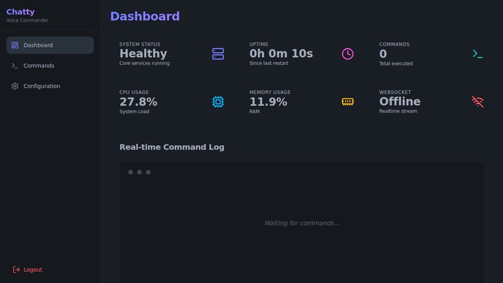

# ChattyCommander

An advanced AI-powered voice command system with a modern Web interface, capable of executing complex workflows, system interactions, and real-time communication.

## Recent Updates
- **Test Cleanup**: Removed low-quality test files (`test_cli_coverage.py`, `test_browser_analyst_perf.py`, `test_llm_processor.py`) and improved test coverage
- **Dependency Updates**: Updated voice pipeline dependencies and audio configuration APIs
- **Security Enhancements**: Fixed authentication middleware and path traversal vulnerabilities
- **UI Improvements**: DaisyUI migration for modern interface with improved accessibility

## Getting Started
We have recently restructured our documentation to make onboarding easier!

Please refer to the organized **User Guide** below:

1. [Installation Guide](docs/user-guide/01_INSTALLATION.md)
2. [Configuration Guide](docs/user-guide/02_CONFIGURATION.md)
3. [Dashboard & Web UI](docs/user-guide/03_DASHBOARD_AND_WEBUI.md)
4. [Voice Modes & Commands](docs/user-guide/04_VOICE_MODES_AND_COMMANDS.md)

## Developer Documentation
Looking to modify the core functionality or add new LLM adapters?
Check out our extensive [Developer Docs](docs/developer/) section.

## License
MIT License
