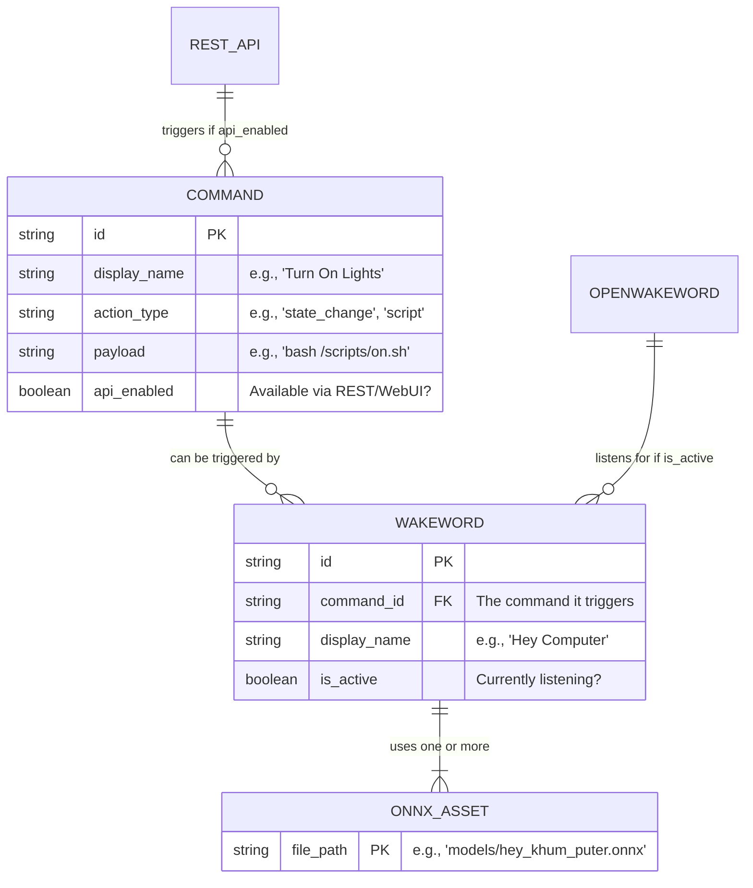

# Architecture Overview

> See also [ARCHITECTURE.md](ARCHITECTURE.md) for directory-level detail.

## High-Level Design

Chatty Commander's architecture is divided into the **Current Implementation** and **Future Potential**. 

### Current State: Command & Wakeword Configuration
At its core today, Chatty Commander is a system for configuring and executing commands (via REST API or OpenWakeWord audio triggers).

```
┌─────────────────────────────────────────────┐
│                  Frontend                    │
│   Web UI (React)   │                         │
└────────────┬─────────────────────────────────┘
             │ HTTP                            │
┌────────────▼─────────────────────────────────┐
│              FastAPI Web Server               │
│  /api/v1/*                                    │
└────────────────────┬─────────────────────────┘
                     │
┌────────────────────▼─────────────────────────┐
│           Core Application (src/)             │
│  ┌──────────┐ ┌──────────────┐               │
│  │   Voice  │ │  Orchestrator│               │
│  │(Wake Word│ │  (Commands)  │               │
│  └──────────┘ └──────────────┘               │
└──────────────────────────────────────────────┘
```

### Future Potential: Multi-Modal Assistant
The architecture has been designed with future expansion in mind. These components are conceptual potentials that are not fully realized yet:
- **LLM Advisors**: Conversational AI personas, memory, and an LLM manager (OpenAI/Ollama).
- **Desktop GUI**: Native applications leveraging PyWebView.
- **3D Avatar**: Real-time 3D GUI with lip-sync capabilities via WebSocket (`/avatar/ws`).

## Key Modules

| Module | Purpose | Status |
|--------|---------|--------|
| `web/` | FastAPI server, routers, authentication | **Current** |
| `app/` | Configuration, state machine, command orchestration | **Current** |
| `cli/` | Command-line interface and REPL (*useful for dev/debugging, but deployment relies on systemd/Docker*) | *WIP* |
| `advisors/` | LLM conversation management, personas, memory | *Future* |
| `llm/` | Unified LLM backend (OpenAI, Ollama, local) | *Future* |
| `avatars/` | 3D avatar state management and lip-sync | *Future* |

As the application evolves, the central actionable entity is the **Command**. A Command (e.g., executing a script, changing state, querying an LLM) can be triggered through multiple vectors.

### Trigger Vectors
1. **WebUI / REST API**: Direct execution by the user clicking a button, or an external script hitting the API (`POST /api/v1/commands/execute`).
2. **Wakewords**: Audio triggers processed by the OpenWakeWord engine. If enabled, the engine monitors the audio stream and fires the event when detected.

A single Wakeword can be composed of one or more ONNX file assets (to capture variations of the same trigger). All ONNX files are placed in the `/models/` directory.

### Entity Relationship Diagram


## Key Modules

| Module | Purpose |
|--------|---------|
| `advisors/` | LLM conversation management, personas, memory |
| `llm/` | Unified LLM backend (OpenAI, Ollama, local, mock) |
| `web/` | FastAPI server, routers, authentication |
| `cli/` | Command-line interface and REPL |
| `avatars/` | 3D avatar state management and lip-sync |
| `app/` | Configuration, state machine, orchestration |

## Communication Flows

- **REST**: `GET/POST /api/v1/*` for config, commands, agents
- **WebSocket**: `/avatar/ws` for real-time avatar animations
- **Metrics**: `/metrics/json` (JSON) and `/metrics/prom` (Prometheus)

## Security

- JWT authentication (configurable, disable with `--no-auth` for dev)
- Rate limiting: 100 req/min default
- XSS/CSRF headers via middleware

For extension points see [ADAPTERS.md](ADAPTERS.md).
