# 🛠️ ChattyCommander Developer Guide

[](#architecture-overview)
[](#testing-strategy)
[](#code-quality)

Welcome to the ChattyCommander developer documentation! This guide provides comprehensive technical details for contributors, maintainers, and anyone interested in understanding the system's architecture.

## 🏗️ Architecture Overview

ChattyCommander follows a modular, event-driven architecture designed for scalability and maintainability.

```mermaid
graph TB
    subgraph "User Interfaces"
        CLI["🖥️ CLI Interface"]
        GUI["🎨 Desktop GUI"]
        WEB["🌐 Web Interface"]
    end

    subgraph "Core Engine"
        MAIN["🎯 Main Orchestrator"]
        STATE["📊 State Manager"]
        CONFIG["⚙️ Config Manager"]
    end

    subgraph "Voice Processing"
        VOICE["🎤 Voice Engine"]
        WAKE["👂 Wake Word Detection"]
        ONNX["🧠 ONNX Models"]
    end

    subgraph "Action Execution"
        ACTIONS["⚡ Action Executor"]
        KEYS["⌨️ Keypress Handler"]
        HTTP["🌐 HTTP Client"]
        SYS["💻 System Commands"]
    end

    subgraph "External Integrations"
        HA["🏠 Home Assistant"]
        DISCORD["💬 Discord Bridge"]
        ADVISORS["🤖 AI Advisors"]
    end

    CLI --> MAIN
    GUI --> MAIN
    WEB --> MAIN

    MAIN --> STATE
    MAIN --> CONFIG
    MAIN --> VOICE

    VOICE --> WAKE
    WAKE --> ONNX

    STATE --> ACTIONS
    ACTIONS --> KEYS
    ACTIONS --> HTTP
    ACTIONS --> SYS

    HTTP --> HA
    HTTP --> DISCORD
    HTTP --> ADVISORS
```



## 🔄 System Flow Diagrams

### Voice Command Processing Flow


### Web API Request Flow


### Configuration Management Flow


## 📁 Project Structure

ChattyCommander follows a clean, organized directory structure optimized for development and deployment:

```
chatty-commander/
├── 📁 config/                        # Centralized configuration
│   ├── .env.template                 # Environment variables template
│   ├── config.json                   # Main configuration
│   └── config.json.template          # Configuration template
├── 📁 deploy/                        # Deployment and packaging
│   ├── Dockerfile                    # Container definition
│   ├── docker/                       # Docker compose and configs
│   ├── k8s/                          # Kubernetes manifests
│   └── packaging/                    # Distribution packaging
├── 📁 docs/                          # Documentation
├── 📁 frontend/                      # User interfaces
│   ├── desktop-app/                  # React desktop application
│   └── web-app/                      # Web interface
├── 📁 models/                        # ONNX voice models
│   ├── chatty/                       # Chatbot interaction models
│   ├── computer/                     # System control models
│   ├── idle/                         # Wake word detection models
│   └── wakewords/                    # Additional wake word models
├── 📁 scripts/                       # Development and utility scripts
├── 📁 server/                        # Backend server and API
│   ├── routes/                       # API route handlers
│   ├── services/                     # Business logic services
│   ├── middleware/                   # Express/FastAPI middleware
│   └── workers/                      # Background workers
├── 📁 shared/                        # Shared utilities and components
├── 🎯 src/chatty_commander/          # Core Python application
│   ├── 🎤 voice/                     # Voice processing modules
│   ├── 🌐 web/                       # FastAPI web server
│   ├── 🎨 gui/                       # Desktop GUI components
│   ├── ⚙️ cli/                       # Command-line interface
│   ├── 🤖 llm/                       # LLM integrations
│   └── 🔧 utils/                     # Shared utilities
└── 🧪 tests/                         # Comprehensive test suite
```

### Key Organizational Principles

- **Consolidation**: Related functionality grouped into logical directories
- **Separation of Concerns**: Clear boundaries between frontend, backend, deployment, and configuration
- **Scalability**: Structure supports growth and modular development
- **Developer Experience**: Intuitive navigation and reduced cognitive load

## 🧪 Testing Strategy

Our testing approach ensures reliability and maintainability:

### Test Categories

1. **🔒 Guard Tests** (`test_web_server_guards.py`)

   - Import safety validation
   - Router inclusion verification
   - Idempotency testing

1. **🛡️ Syntax Safety** (`test_syntax_safety.py`)

   - AST-based regression testing
   - Orphan try/except block detection
   - Code quality enforcement

1. **🔗 Integration Tests**

   - End-to-end workflow validation
   - External service integration
   - API contract testing

1. **⚡ Performance Tests**

   - Voice processing latency
   - Memory usage monitoring
   - Concurrent request handling

### Running Tests

```bash
# Run all tests
uv run pytest

# Run specific test categories
uv run pytest tests/test_web_server_guards.py -v
uv run pytest tests/test_syntax_safety.py -v

# Run with coverage
uv run pytest --cov=src/chatty_commander --cov-report=html

# Performance testing
uv run pytest tests/test_performance.py -v
```

## 🔧 Development Workflow

### Setting Up Development Environment

```bash
# Clone and setup
git clone https://github.com/matthewhand/chatty-commander.git
cd chatty-commander

# Install development dependencies
uv sync --group dev --group voice --group test

# Install pre-commit hooks
uv run pre-commit install

# Verify setup
make gate  # Run quality checks
make guard # Run comprehensive tests
```

### Code Quality Standards

We maintain high code quality through automated tooling:

- **🔍 Linting**: `ruff` for Python code analysis
- **🎨 Formatting**: `ruff format` for consistent code style
- **📝 Type Checking**: `mypy` for static type analysis
- **🔒 Security**: `bandit` for security vulnerability scanning
- **📊 Coverage**: `pytest-cov` for test coverage reporting

### Pre-commit Hooks

Our pre-commit configuration ensures code quality:

```yaml
# .pre-commit-config.yaml highlights
- repo: https://github.com/astral-sh/ruff-pre-commit
  hooks:
    - id: ruff # Linting
    - id: ruff-format # Formatting

- repo: https://github.com/pre-commit/mirrors-mypy
  hooks:
    - id: mypy # Type checking

- repo: https://github.com/PyCQA/bandit
  hooks:
    - id: bandit # Security scanning
```

## 🏗️ Component Deep Dive

### Voice Engine Architecture

The voice processing system is built for real-time performance:

```python
class VoiceEngine:
    """Core voice processing engine with ONNX model integration."""

    def __init__(self, config: VoiceConfig):
        self.models = self._load_onnx_models(config.model_paths)
        self.audio_processor = AudioProcessor(config.audio_settings)
        self.state_manager = StateManager()

    async def process_audio_stream(self, audio_data: bytes) -> Optional[Command]:
        """Process incoming audio and detect wake words."""
        features = self.audio_processor.extract_features(audio_data)

        for model_name, model in self.models.items():
            confidence = model.predict(features)
            if confidence > self.threshold:
                return self._create_command(model_name, confidence)

        return None
```

### State Management System

The state manager coordinates system behavior:

```python
class StateManager:
    """Manages application state transitions and model loading."""

    def __init__(self):
        self.current_state = "idle"
        self.state_models = {}
        self.observers = []

    async def transition_to(self, new_state: str) -> bool:
        """Transition to a new state with proper cleanup."""
        if new_state not in self.valid_states:
            raise InvalidStateError(f"Unknown state: {new_state}")

        # Cleanup current state
        await self._cleanup_current_state()

        # Load new state models
        await self._load_state_models(new_state)

        # Update state
        old_state = self.current_state
        self.current_state = new_state

        # Notify observers
        await self._notify_state_change(old_state, new_state)

        return True
```

### Web API Design

Our FastAPI implementation follows REST principles:

```python
# Router structure
app = FastAPI(
    title="ChattyCommander API",
    description="Voice-activated system control",
    version="1.0.0"
)

# Core routers
app.include_router(health_router, prefix="/api/v1")
app.include_router(config_router, prefix="/api/v1")
app.include_router(state_router, prefix="/api/v1")
app.include_router(agents_router, prefix="/api/v1")
app.include_router(avatar_router, prefix="/avatar")
app.include_router(metrics_router, prefix="/metrics")

# WebSocket endpoints
app.include_router(websocket_router, prefix="/ws")
```

## 🔌 Extension Points

### Adding New Voice Models

1. **Train ONNX Model**: Create your wake word detection model
1. **Model Placement**: Add to appropriate `models-*` directory
1. **Configuration**: Update `config.json` with model mapping
1. **Testing**: Add tests for new wake word detection

### Creating Custom Actions

```python
class CustomAction(BaseAction):
    """Example custom action implementation."""

    async def execute(self, context: ActionContext) -> ActionResult:
        """Execute the custom action."""
        # Your custom logic here
        result = await self._perform_action(context)

        return ActionResult(
            success=True,
            message="Custom action completed",
            data=result
        )
```

### Adding New API Endpoints

```python
from fastapi import APIRouter

router = APIRouter()

@router.get("/custom-endpoint")
async def custom_endpoint():
    """Custom API endpoint."""
    return {"message": "Custom functionality"}

# Register in main app
app.include_router(router, prefix="/api/v1")
```

## 📊 Monitoring and Observability

### Metrics Collection

We provide comprehensive metrics for monitoring:

- **Voice Processing**: Latency, accuracy, model performance
- **API Performance**: Request rates, response times, error rates
- **System Health**: Memory usage, CPU utilization, disk space
- **Business Metrics**: Command execution rates, state transitions

### Health Checks

```bash
# System health
curl http://localhost:8100/api/v1/health

# Detailed status
curl http://localhost:8100/api/v1/status

# Prometheus metrics
curl http://localhost:8100/metrics/prom

# JSON metrics
curl http://localhost:8100/metrics/json
```

## 🚀 Deployment Strategies

### Docker Deployment

```dockerfile
# Multi-stage build for optimized image
FROM python:3.11-slim as builder
WORKDIR /app
COPY requirements.txt .
RUN pip install --no-cache-dir -r requirements.txt

FROM python:3.11-slim
WORKDIR /app
COPY --from=builder /usr/local/lib/python3.11/site-packages /usr/local/lib/python3.11/site-packages
COPY . .
EXPOSE 8100
CMD ["python", "main.py", "--web", "--port", "8100"]
```

### Kubernetes Deployment

```yaml
apiVersion: apps/v1
kind: Deployment
metadata:
  name: chatty-commander
spec:
  replicas: 3
  selector:
    matchLabels:
      app: chatty-commander
  template:
    metadata:
      labels:
        app: chatty-commander
    spec:
      containers:
        - name: chatty-commander
          image: chatty-commander:latest
          ports:
            - containerPort: 8100
          env:
            - name: CONFIG_PATH
              value: "/app/config.json"
          resources:
            requests:
              memory: "256Mi"
              cpu: "250m"
            limits:
              memory: "512Mi"
              cpu: "500m"
```

## 🤝 Contributing Guidelines

### Pull Request Process

1. **🔀 Fork & Branch**: Create feature branch from `main`
1. **💻 Develop**: Implement changes with tests
1. **🧪 Test**: Ensure all tests pass (`make gate && make guard`)
1. **📝 Document**: Update documentation as needed
1. **🔍 Review**: Submit PR with clear description

### Code Review Checklist

- [ ] ✅ All tests pass
- [ ] 📊 Code coverage maintained/improved
- [ ] 📝 Documentation updated
- [ ] 🔒 Security considerations addressed
- [ ] ⚡ Performance impact assessed
- [ ] 🎯 Follows established patterns

## 🔗 Additional Resources

- **📖 [API Documentation](docs/API.md)** - Complete API reference
- **🏗️ [Architecture Deep Dive](docs/ARCHITECTURE_OVERVIEW.md)** - Detailed system design
- **🔧 [Configuration Guide](docs/CONFIG_SCHEMA.md)** - Configuration options
- **🐛 [Troubleshooting](docs/TROUBLESHOOTING.md)** - Common issues and solutions
- **🎯 [Roadmap](docs/DEVELOPMENT_ROADMAP.md)** - Future development plans

______________________________________________________________________

**Ready to contribute?** Check out our [Contributing Guide](CONTRIBUTING.md) and join our community of developers building the future of voice-controlled computing! 🚀
