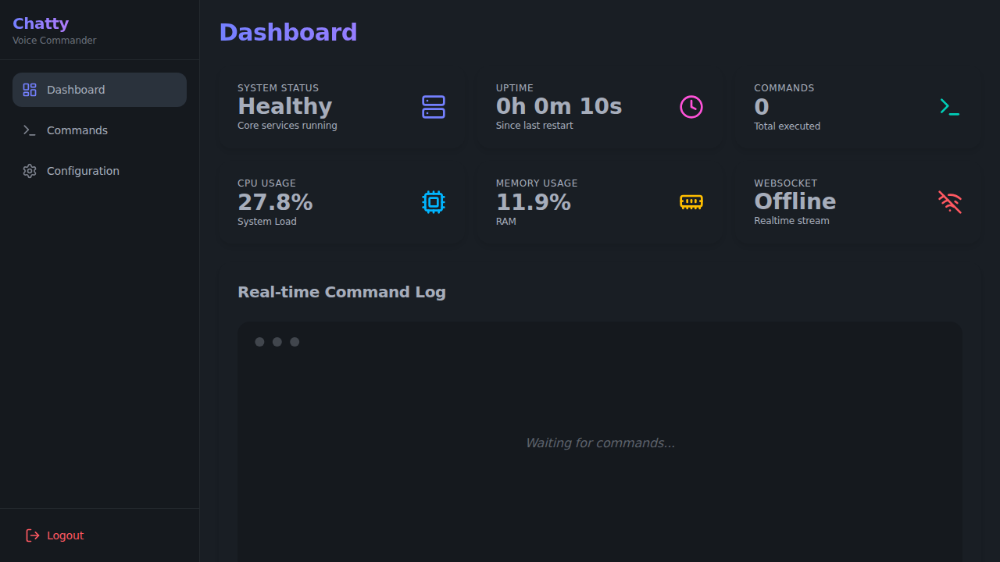
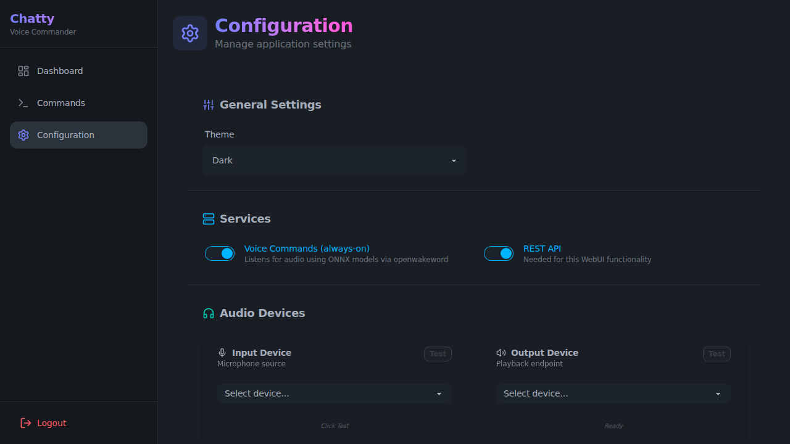
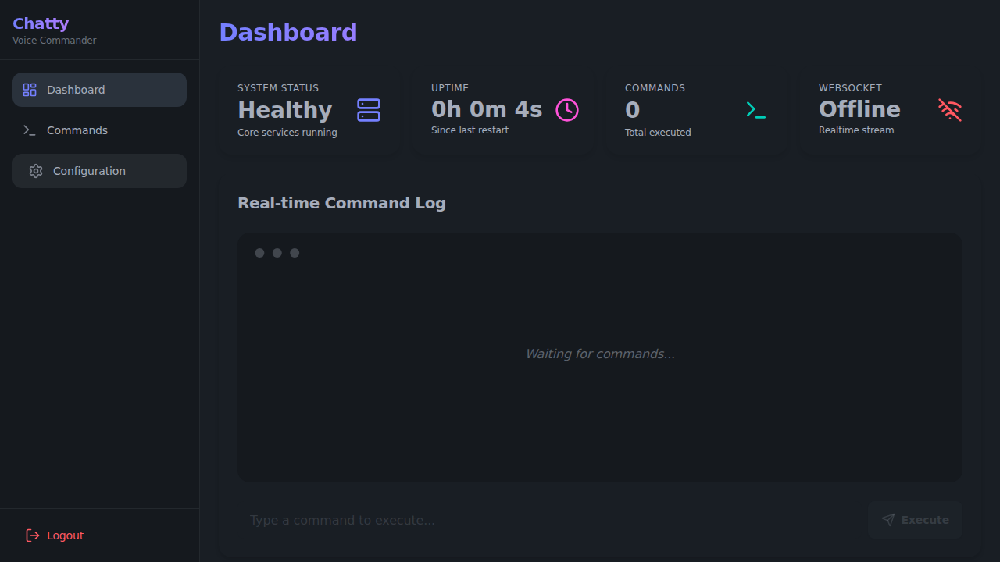

# ChattyCommander User Guide

Welcome to the ChattyCommander User Guide. This document provides detailed instructions on how to use the WebUI, configure the system, and monitor system health.

## System Dashboard

The Dashboard provides a real-time overview of the system status, including core services, uptime, command execution statistics, and resource usage.



### Metrics Explained

- **System Status**: Indicates if the core services are running and healthy.
- **Uptime**: The duration the system has been running since the last restart.
- **Commands**: The total number of commands executed (both voice and API).
- **CPU Usage**: The current CPU utilization of the host machine.
- **Memory Usage**: The current RAM utilization of the host machine.
- **WebSocket**: status of the realtime connection to the backend.

### Real-time Command Log

The dashboard also displays a log of recent commands executed and system messages. You can use the input box to manually execute commands.

## Configuration

The Configuration page allows you to manage application settings, services, and audio devices.



### Key Settings

- **General Settings**: Change the UI theme.
- **Services**: Enable or disable Voice Commands and REST API.
- **Audio Devices**: Select input (microphone) and output (speaker) devices. Includes test functionality.
- **LLM Endpoint**: Configure the AI backend (OpenAI, Ollama, etc.).

## Login

If authentication is enabled, you will be presented with a login screen.



## Generating Screenshots

This documentation includes screenshots generated automatically from the current codebase. To regenerate them:

1. Navigate to the frontend directory:
   ```bash
   cd webui/frontend
   ```

2. Run the generation script:
   ```bash
   npm run generate-screenshots
   ```

   This will run a Playwright test suite that captures screenshots of key pages and saves them to `docs/images/`.
