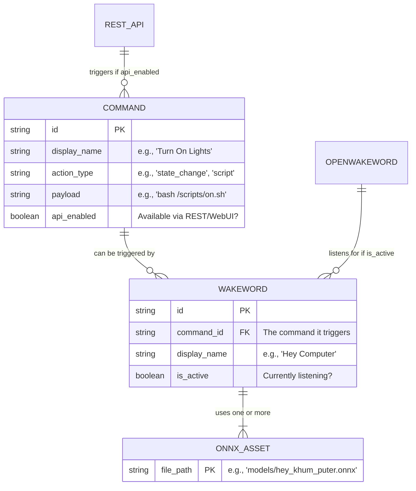

# Chatty Commander Architecture

This document outlines the architectural design and organizational principles of Chatty Commander, a voice-controlled AI assistant system.

## High-Level Design

Chatty Commander's architecture is divided into the **Current Implementation** and **Future Potential**. 

### Current State: Command & Wakeword Configuration
At its core today, Chatty Commander is a system for configuring and executing commands (via REST API or OpenWakeWord audio triggers).

```text
┌─────────────────────────────────────────────┐
│                  Frontend                    │
│   Web UI (React)   │                         │
└────────────┬─────────────────────────────────┘
             │ HTTP                            │
┌────────────▼─────────────────────────────────┐
│              FastAPI Web Server               │
│  /api/v1/*                                    │
└────────────────────┬─────────────────────────┘
                     │
┌────────────────────▼─────────────────────────┐
│           Core Application (src/)             │
│  ┌──────────┐ ┌──────────────┐               │
│  │   Voice  │ │  Orchestrator│               │
│  │(Wake Word│ │  (Commands)  │               │
│  └──────────┘ └──────────────┘               │
└──────────────────────────────────────────────┘
```

### Future Potential: Multi-Modal Assistant
The architecture has been designed with future expansion in mind. These components are conceptual potentials:
- **LLM Advisors**: Conversational AI personas, memory, and an LLM manager (OpenAI/Ollama).

## Directory Organization

The project follows a domain-driven organization pattern, grouping related functionality into logical directories:

### Core Application (`src/chatty_commander/`)
The main Python package containing the core business logic:
- Voice processing and wake word detection
- AI model integration and conversation management
- Computer automation and task execution
- Configuration management and system coordination

### Models (`models/`)
Consolidated directory for all AI models and related assets:
- `chatty/` - Conversational AI models and prompts
- `computer/` - Computer vision and automation models
- `idle/` - Background processing and idle state models
- `wakewords/` - Wake word detection models and configurations

### Frontend Applications (`frontend/`)
User interface components separated by platform:
- `desktop-app/` - Native desktop application
- `web-app/` - Web-based user interface (WebUI)

### Server Infrastructure (`server/`)
Backend services and worker processes:
- Core server implementation
- `workers/` - Background processing and canvas building workers
- API endpoints and service coordination

### Configuration (`config/`)
Centralized configuration management:
- Application configuration files
- Environment templates
- Runtime configuration schemas

### Deployment (`deploy/`)
Deployment and packaging artifacts:
- `docker/` - Container definitions and orchestration
- `k8s/` - Kubernetes manifests and configurations
- `packaging/` - Distribution packages and installers
- `Dockerfile` - Main container definition

## Architectural Principles

### 1. Separation of Concerns
Each directory has a clear, single responsibility:
- Models are isolated from application logic
- Frontend and backend are cleanly separated
- Configuration is centralized and environment-agnostic
- Deployment concerns are isolated from development

### 2. Platform Agnostic Design
The core system (`src/`) is designed to work across different platforms, with platform-specific implementations in dedicated directories.

### 3. Modular Model Management
AI models are organized by function rather than technology.

### 4. Scalable Deployment
Deployment configurations support multiple environments.

## Data Flow

1. **Voice Input**: Audio captured through frontend applications
2. **Wake Word Detection**: Processed using models in `models/wakewords/`
3. **Speech Recognition**: Converted to text using speech models
4. **Intent Processing**: Analyzed using conversational models in `models/chatty/`
5. **Task Execution**: Computer tasks executed using `models/computer/`
6. **Response Generation**: Responses generated and delivered through frontend

## Trigger Vectors & Entity Relationship
1. **WebUI / REST API**: Direct execution by the user clicking a button, or an external script hitting the API (`POST /api/v1/commands/execute`).
2. **Wakewords**: Audio triggers processed by the OpenWakeWord engine.



## Key Modules

| Module | Purpose | Status |
|--------|---------|--------|
| `web/` | FastAPI server, routers, authentication | **Current** |
| `app/` | Configuration, state machine, command orchestration | **Current** |
| `cli/` | Command-line interface and REPL | *WIP* |
| `advisors/` | LLM conversation management, personas, memory | *Future* |
| `llm/` | Unified LLM backend (OpenAI, Ollama, local, mock) | *Future* |

## Technology Stack

- **Core**: Python with async/await patterns
- **Frontend**: Web-based via React/Vite
- **Models**: Various AI/ML frameworks
- **Server**: FastAPI
- **Deployment**: Docker, Kubernetes, native packaging

## Communication Flows

- **REST**: `GET/POST /api/v1/*` for config, commands, agents
- **WebSocket**: `/api/v1/ws` for real-time events
- **Metrics**: `/metrics/json` (JSON) and `/metrics/prom` (Prometheus)

## Security

- JWT authentication (configurable, disable with `--no-auth` for dev)
- Rate limiting: 100 req/min default
- XSS/CSRF headers via middleware

For extension points see [ADAPTERS.md](ADAPTERS.md).
