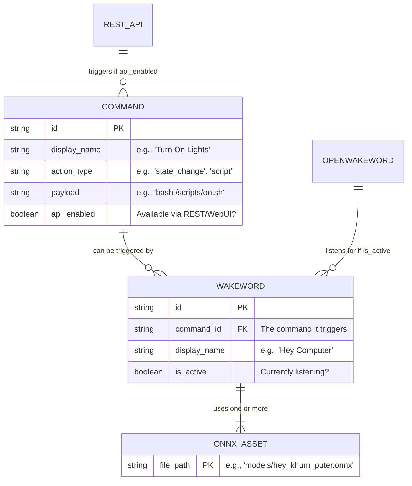

# Chatty Commander Architecture and Vision

**Front and center: our vision for a reliable, local-first voice automation platform.**

## Vision

**Front and center:** ChattyCommander is a local-first, extensible voice-first automation platform. The goal is reliable wake-word driven control that just works on your hardware, with zero cloud required for core use, and graceful opt-in for powerful advisors and telephony.

**Core user journey (the vision in action):**
1. User configures wake words + commands (via the web dashboard or CLI).
2. Background listener (OpenWakeWord ONNX or orchestrator mode) detects wake → records utterance.
3. Transcription (pluggable: local Whisper or mock) + command match (keywords or advisor consult).
4. Action dispatch: keypress simulation, open URL, run shell, custom, voice_chat, or dograh_call (self-hosted telephony).
5. Feedback: state changes, WS live updates to dashboard (stats, agents, logs, performance charts), optional TTS response.
6. Extensibility: LLM advisors (with tools like browser_analyst, switch_mode, dograh_place_call) for conversational smarts; pluggable STT/TTS/LLM backends; modular adapters.

**Guiding principles (front and centre):**
- Local by default, optional cloud (Ollama/OpenAI for advisors, Edge TTS etc).
- Production-ready from day one: auth, rate limits, structured logs/metrics, e2e tests, Docker.
- Modular and hackable: adapters, tools registry, thin core pipelines for easy extension.
- Simple for end-users (web SPA + config), powerful for tinkerers (CLI, advisors, full source).
- Honest status always: ✅ solidly built, 🟡 partial, 🔲 not yet — see assessment + FEATURE_STATUS.
- Evolve by pruning: we keep what ships, archive the rest (see Legacy).

See the [Roadmap](../../ROADMAP.md) for the path to 1.0 and beyond. The current architecture directly supports this vision (thin wake→action loop + rich web + advisors).

## Honest Assessment: What Is Already Built

A detailed, evidence-based audit lives in the root [FEATURE_STATUS.md](../../FEATURE_STATUS.md) (last mechanical audit 2026-06-10; re-verify before relying). High-level summary (verified against current tree; legend: ✅ solidly working, 🟡 partial/gaps, 🔲 unstarted/legacy; totals from audit ~38✅ / 12🟡 / 2🔲 / 2❌ across 54 rows):

**Compact snapshot (ties directly to Vision):**
- Voice (wake/transcribe/tts/pipeline): ✅🟡 (core ONNX + mocks wired; real listening via `--orchestrate --enable-openwakeword` or self-test; optional deps not in base pyproject)
- Commands + State machine + dograh_call actions: ✅
- Web backend (FastAPI routers, WS, auth, audio/prefs/themes/agents/system): ✅
- Web UI (React SPA + dashboard + authoring + Playwright e2e): ✅🟡
- Advisors/LLM providers + memory/tools: ✅ (stubs when no key/sdk)
- CLI + modes + orchestrator: ✅🟡 (dual cli paths noted in ROADMAP)
- Tests (py + e2e ~1100+), Docker, packaging, security basics: ✅
- Integrations (dograh): ✅🟡
- Desktop GUI / Avatar: 🟡🔲 (legacy remnants; web is primary)
- Infra / Observability: ✅

**Solidly Working (✅ stable / well-tested):**
- Wake-word detection (OpenWakeWord ONNX, state machine for idle/chatty/computer models).
- Voice transcription (pluggable Whisper + mocks) and TTS (pyttsx3 default + optional Edge).
- Command execution (config-driven: keypress, url, shell, custom_message, voice_chat, dograh_call).
- Full Web UI (React + DaisyUI + Tanstack Query): dashboard with stats/log/WS/performance/agents, command authoring + CRUD, configuration (audio, themes, prefs, models), login.
- Backend: FastAPI with X-API-Key auth, WebSockets for real-time, standardized responses, OpenAPI.
- CLI (uv run chatty-commander) + subcommands, modes, dograh integration.
- LLM Advisors: personas, memory, tools (browser analyst etc) via openai-agents or Ollama.
- dograh voice calls: CLI, status card, integration hardened (optional compose stack).
- Testing: 1100+ Python tests + Playwright e2e; CI green on main.
- Packaging/ops: Docker, uv, ruff/mypy.
- Metrics, structured logging, auth middleware on both factories.

**Partial / Gaps (🟡):**
- Voice in default basic mode is simulated (real listening requires `--orchestrate --enable-openwakeword` or self-test).
- Some optional deps (whisper, pyttsx3, edge-tts, PyQt5) are not in core `pyproject.toml` (mypy overrides only; manual install for real use).
- Desktop GUI / avatar: legacy PyQt5 tray + webview code exists but unfinished; web dashboard is the supported path.
- Bridges (Discord/Slack): orchestrator routes but external client not fully maintained.
- dograh end-to-end: requires user to author workflows + configure telephony provider (key rotation remaining P0).
- Frontend unit tests: Playwright e2e strong; Vitest setup present but incomplete.
- Certain web voice endpoints flip state only (no full pipeline control yet).
- CLI dual implementation (cli/cli.py primary vs legacy main.py via __main__).
- LLM module: some consolidation opportunities.
- Docker image build/run not exhaustively verified in recent audits.

**Unstarted or Removed (🔲 / legacy):**
- Full Kubernetes manifests, Celery queues, etc. (deliberately dropped for simplicity).
- Old experimental full "AI Framework" (intelligence_core, heavy conversation engine) was validated then consolidated/refactored into leaner advisors/llm.
- Early avatar 3D GUI and separate desktop shells superseded.
- CV input adapter (Dummy only now; full CV pruned post-reset).

See [ROADMAP.md](../../ROADMAP.md) (P0/P1/P2) and [WEBUI_ISSUES.md](WEBUI_ISSUES.md) for precise remaining items and honest gaps. Documentation, security, and dead-code cleanup are high in P1. **This document (ARCHITECTURE) is the front-and-centre place for vision + honest snapshot + legacy context.**

## Legacy and Archived Architectures

This section archives previous designs and experiments for historical context. Early development explored a broader "full AI framework" (heavy `intelligence_core`, `conversation_engine`, experimental task runners) which was validated in spikes but later consolidated into the leaner `advisors/` + `llm/` modules for maintainability and to focus on the core wakeword → action loop. We keep the record so future contributors understand why the current shape exists (thin, testable, web-first).

**How previous architectures looked (concrete shapes and examples):**

- **"Full AI Framework" era (intelligence_core + conversation_engine)**: A single large module handled wake, transcription, LLM conversation state, tool dispatch, memory, and response in one flow. Heavy use of global state, long methods like `process_turn()` that mixed STT/LLM/execution. Spikes proved concept but led to high complexity and hard testing. Refactored out: core loop now thin (see `voice/pipeline.py` delegating to helpers `_match_by_keywords`, `_handle_matched_command`), advisors split into focused services + tools, LLM backends pluggable.

- **Global state + process_turn in intelligence_core (concrete shape)**: Central classes (e.g. ~1000+ LOC IntelligenceCore / ConversationEngine) performed the full turn in one call: audio capture → STT → intent parse / keyword + LLM → memory side-effects → command lookup → exec + response synthesis. Shared mutable dicts for "context/state", ad-hoc registries, little isolation. Unit tests required heavy monkey-patching; adding a new command type touched 5 files. Current: narrow `VoicePipeline`, explicit `StateManager`, `CommandExecutor` with `_get_*` helpers, `AdvisorsService` + pluggable providers.
  > Approximate old shape (from git history / prior audits):
  > ```python
  > # OLD (monolithic intelligence_core.py excerpt)
  > def process_turn(self, audio_bytes):
  >     text = self.stt.transcribe(audio_bytes)  # mixed
  >     state = self.memory.get_global_context()  # mutable shared
  >     intent = self.llm.parse_or_keyword(text, state)
  >     if cmd := self.registry.lookup(intent):
  >         self.executor.execute(cmd)  # side effects everywhere
  >     self.memory.persist(state)
  >     ...
  > ```

- **Avatar GUI / Desktop Shell**: Used PyQt5 + QWebEngine or pywebview for a persistent tray icon + floating avatar window. State synced over WS (thinking_state.py). Visuals included "listening", "processing", "speaking" animations. Replaced by web dashboard because cross-platform packaging, accessibility and mobile-friendliness favored browser UI. Legacy remnants in `gui/` and `avatars/` (unfinished, not launched in default paths). Old avatar launch paths in cli/gui_mode + avatar_ws remnants still exist for WS thinking sync only.

- **Old Frontend Experiments**: Had root-level `frontend/` with separate Next.js (pages router) apps for web and desktop; also a standalone Express/Flask server in early `server/`. Dupe API clients, theming via CSS vars duplicated in JS. Consolidated 2025-2026 into single Vite+React SPA at `webui/frontend/` + DaisyUI + Tanstack, with webServer integration in Playwright config. (See removed `frontend/web-app/`, `frontend/desktop-app/` trees.)

- **Monolithic providers and early command executor**: `providers/` + `tools/` had lots of if/elif dispatch for "simulate key", "shell", "http". Command matching was regex soup in one place. Current: `command_executor.py` uses small `_get_command_action`, `_validate_*` helpers; voice uses keyword map + direct name match. (Orphaned `src/chatty_commander/providers/` package was later cleaned.)

- **Pre-refactor voice pipeline**: `_process_voice_command` was a 200+ line method with nested ifs for matching, state changes, execution, logging. (See git history for the pre-extract version.) Now: thin delegator calling `_safe_change_state`, `_handle_matched_command`, `_match_by_keywords`, etc. Extracted for testability.

  Example (simplified current shape in `voice/pipeline.py`):
  ```python
  def _process_voice_command(self, command: str) -> bool:
      if matched := self._match_by_keywords(command):
          return self._handle_matched_command(matched)
      ...
  ```

- **Dual CLI paths (recent legacy)**: Two parallel implementations co-existed (`cli/cli.py` ~900 LOC used by entrypoint vs legacy `cli/main.py` reached via `__main__.py`). Parsers could drift. Being converged (see ROADMAP P1).

- **Spike branches and experiments**: webRTC audio bridge (see `WEBRTC_BRIDGE_SPIKE.md`), full dograh loopback, heavy memoization on every advisor call, Celery task queue PoC, k8s manifests (intentionally dropped to keep simple single-binary + docker story). Many perf wins landed; infrastructure bloat was pruned.

See [PROJECT_HISTORY.md](PROJECT_HISTORY.md) for snapshot summaries of earlier status. Most legacy UI and experimental AI paths were intentionally archived to keep the project focused and shippable as FOSS. Syntax-rot episode (large squash 2026-06) temporarily injected literal conflict markers into src/ (now the focus of 5m cleanup loops).

**Recent note on "syntax rot" episode (2026-06)**: A large squash merge for syntax cleanup + test expansion temporarily left literal conflict markers in dozens of files (uv.lock + 50+ .py). This was the state at the start of focused cleanup. Resolution is mechanical (preferring refactored thin-helper and current HEAD logic) and tracked via loops. See git blame and `scripts/guarded_commit.sh` which now guards against recurrence.

## What Remains

See the canonical [ROADMAP.md](../../ROADMAP.md) (P0 publish blockers, P1 quality, P2 post-launch) and [WEBUI_ISSUES.md](WEBUI_ISSUES.md) for detailed gaps. High-level honest items from current audits (re-inspected 2026-06-18 during docs expansion loop):

- P0: Rotate dograh keys at provider; frontend unit test completeness (Vitest); certain CLI wiring convergence.
- Voice experience gaps in default CLI path (simulation vs real pipeline).
- Desktop/avatar completion (deprioritized in favor of web; remnants only).
- Full dograh end-to-end user setup documentation and provider configs.
- Some dependency hygiene for optional TTS/STT (keep out of core to avoid bloat).
- Continued docs accuracy, coverage on thin areas, and dead code pruning.
- **Marker cleanup complete (0f/0b)** in src/ (previously obs/metrics.py etc.; web/web_mode.py, cli/main.py, cli/cli.py etc. 0 markers). Mechanical cleanup tracked in AFK 5m loops (strict: re-inspect, pick ONE file, FULL read_file, EXACTLY ONE search_replace keeping HEAD/refactored thin logic, uv py_compile + import verify, git revert on any NEW red introduced by edit, todo_write merge=true, output ONLY short cycle block). All resolved; pre-existing non-marker collection errs (optional deps) noted separately for py tests. (Current: 0f/0b as of re-inspect. Dual schedulers active for any future. e2e targeted green.)
- Expand e2e (modern locators like getByRole/getByText/.nth(0)/.card:has-text + wired +1-2 endpoint asserts per WEBUI_ISSUES #5 / ROADMAP Phase 4) — 30m scope (separate from 5m src). TS e2e independent (npx playwright test --list green via mocks). Ongoing 30m cycles continue adding wired fetches (e.g. /api/v1/agents/blueprints, /api/v1/commands, /health, themes, status, metrics, voice, audio) and scoping modern locators across dashboard/commands/agents/config specs + py e2e. Recent cycles modernized remaining legacy .stat-value and .first() patterns in websocket/guided_tour/screenshots to use getByText({exact:true}).nth(0) + .filter and .card:has-text for stability.
Additional small expansions target fallback body locators (modernized to getByText in dograh specs) and add native get_by_* / count expects in py e2e SPA shell tests (commands/agents/config) for better journey coverage per WEBUI_ISSUES #5 and ROADMAP Phase 4 testing. 30m cycles have also expanded basic page-load fixtures (e.g. agents_page_loads now has get_by_role expect) for consistency.

- **Docs expansion front-and-centre** (this + ongoing): **Vision** is the north star — reliable local-first wakeword → action platform (see top of this doc and README). Honest ✅🟡🔲 assessment (compact + full FEATURE_STATUS.md table; re-audit snapshots cross-linked). Rich archived/legacy section with concrete previous architectures and code shapes (process_turn in intelligence_core monolith; global mutable state; PyQt5+pywebview avatars + thinking_state WS sync; root Next.js dupes + Express/Flask servers; pre-refactor 200+ LOC _process_voice_command nested ifs; monolithic providers + regex command soup; dual parallel CLIs; pruned spikes like webRTC/Celery/k8s). "What Remains" kept accurate + cross-linked. Playwright TS e2e + docs updates via 30m loops; marker cleanup via dedicated 5m src-only loops. Re-inspected 2026-06-18 (current 0f/0b in core); dual schedulers launched and active for AFK resolution of remaining work. 

**Vision reminder (front and centre):** ChattyCommander delivers a reliable, zero-cloud-required core for wake-word driven automation that feels instant and trustworthy. Wake → local STT → deterministic or advisor-matched command → action (keypress/URL/shell/dograh) with live WS feedback to the dashboard. Everything else (advisors, telephony, optional TTS) is opt-in and gracefully degrades. The architecture and process are deliberately thin and testable so the system stays maintainable as FOSS.

Playwright e2e tests (webui/frontend/tests/e2e/*.spec.ts + tests/e2e/) provide coverage for several wired REST endpoints (e.g. /api/v1/commands with search/filter sync, /health for stats cards, /api/v1/advisors/context/stats for agent cards, /api/v1/themes, /api/v1/status, /api/v1/metrics, /api/v1/agents/blueprints, audio/voice etc) using modern locators + fetch asserts. This allows UI validation independent of Python backend state (markers now resolved; full py e2e unblocked) and demonstrates current command execution + dashboard functionality. Ongoing 30m cycles continue to add modern DOM checks (getByRole/getByText .nth(0)/.filter) and +1-2 wired API asserts per spec to deepen coverage for WS/telemetry and config journeys. Recent 30m work modernized .first() brittle patterns in accessibility.spec.ts (and similar) to .nth(0) for stability, plus docs honesty updates. Additional 30m efforts have modernized legacy input[name] selectors using .filter({has: ...}) in configuration service toggles (voiceCommands/restApi) and expanded Playwright coverage for audio/voice UI flows per WEBUI_ISSUES and ROADMAP Phase 4.

The architecture supports the vision, but full production readiness (security hardening, test depth, docs, packaging polish) is the active focus per the roadmap. We archive the past so the present (and future) stays clean and honest.

## Technology stack

Primary design components, most significant first. Versions reflect `pyproject.toml` and `webui/frontend/package.json`.

| Layer | Component | Role |
|---|---|---|
| Language | **Python 3.11+** | Backend: voice pipeline, command execution, web API, CLI (`src/chatty_commander/`) |
| Language | **TypeScript / JavaScript** | Frontend SPA (`webui/frontend/src/`) |
| Backend framework | **FastAPI** (+ Uvicorn, Pydantic) | REST API, WebSocket channels, app factories (`web/`) |
| Frontend framework | **React 18** (+ React Router 6) | Dashboard SPA pages and components |
| UI styling | **Tailwind CSS 3 + DaisyUI 4** | Styling and the bundled theme system (dark/light/cyberpunk/synthwave) |
| Frontend build | **Vite 5** | Dev server and production build |
| Voice / ML | **OpenWakeWord + ONNX Runtime** | Edge wake-word detection driving the state machine |
| LLM agents | **openai-agents SDK** (OpenAI/Ollama backends) | Advisors and their tools (`advisors/`) |
| Data fetching | **TanStack React Query + axios** | Frontend API/state synchronisation |
| Frontend extras | **framer-motion, recharts, lucide-react** | Animations, dashboard charts, icons |
| Auth & security | **PyJWT + bcrypt** | X-API-Key middleware, token handling |
| Python testing | **pytest** (+ coverage) | ~950 backend tests (`tests/`) |
| Frontend testing | **Vitest + Testing Library; Playwright** | Unit tests and e2e/screenshot suites |
| Tooling | **uv, ruff, mypy** | Environment management, lint, type-checking (all gate CI) |
| Packaging / ops | **Docker (multi-stage, non-root), GitHub Actions, k6** | Container builds, CI/CD, load-test baselines |
| Desktop shell | **pywebview + pystray** | Optional GUI/tray mode (partial — see ROADMAP) |

## High-Level Design

Chatty Commander's architecture is divided into the **Current Implementation** and **Future Potential**. 

### Current State: Command & Wakeword Configuration
At its core today, Chatty Commander is a system for configuring and executing commands (via REST API or OpenWakeWord audio triggers).

```text
┌─────────────────────────────────────────────┐
│                  Frontend                    │
│   Web UI (React)   │                         │
└────────────┬─────────────────────────────────┘
             │ HTTP                            │
┌────────────▼─────────────────────────────────┐
│              FastAPI Web Server               │
│  /api/v1/*                                    │
└────────────────────┬─────────────────────────┘
                     │
┌────────────────────▼─────────────────────────┐
│           Core Application (src/)             │
│  ┌──────────┐ ┌──────────────┐               │
│  │   Voice  │ │  Orchestrator│               │
│  │(Wake Word│ │  (Commands)  │               │
│  └──────────┘ └──────────────┘               │
└──────────────────────────────────────────────┘
```

### Future Potential: Multi-Modal Assistant
The architecture has been designed with future expansion in mind. These components are conceptual potentials:
- **LLM Advisors**: Conversational AI personas, memory, and an LLM manager (OpenAI/Ollama).

## Directory Organization

The project follows a domain-driven organization pattern, grouping related functionality into logical directories:

### Core Application (`src/chatty_commander/`)
The main Python package containing the core business logic:
- Voice processing and wake word detection
- AI model integration and conversation management
- Computer automation and task execution
- Configuration management and system coordination

### Models (`models/`)
Consolidated directory for all AI models and related assets:
- `chatty/` - Conversational AI models and prompts
- `computer/` - Computer vision and automation models
- `idle/` - Background processing and idle state models
- `wakewords/` - Wake word detection models and configurations

### Frontend Application (`webui/frontend/`)
The React/Vite web UI (WebUI). It talks to the FastAPI backend over REST and
WebSocket and is built with `npm run build`.

### Server Infrastructure (`src/chatty_commander/web/`)
The FastAPI backend lives inside the main Python package:
- `server.py` / `web_mode.py` - App factory and server entry points
- `routes/` - REST and WebSocket routers (config, state, audio, themes, preferences, dograh, ...)
- `middleware/` - Authentication and security middleware

### Configuration (`config/`)
Centralized configuration management:
- Application configuration files
- Environment templates
- Runtime configuration schemas

### Deployment (`deploy/`)
Deployment and packaging artifacts:
- `docker/` - Container definitions and orchestration
- `monitoring/` - Monitoring configuration
- `packaging/` - Distribution packages and installers
- `Dockerfile` - Main container definition

## Architectural Principles

### 1. Separation of Concerns
Each directory has a clear, single responsibility:
- Models are isolated from application logic
- Frontend and backend are cleanly separated
- Configuration is centralized and environment-agnostic
- Deployment concerns are isolated from development

### 2. Platform Agnostic Design
The core system (`src/`) is designed to work across different platforms, with platform-specific implementations in dedicated directories.

### 3. Modular Model Management
AI models are organized by function rather than technology.

### 4. Scalable Deployment
Deployment configurations support multiple environments.

## Data Flow

1. **Voice Input**: Audio captured through frontend applications
2. **Wake Word Detection**: Processed using models in `models/wakewords/`
3. **Speech Recognition**: Converted to text using speech models
4. **Intent Processing**: Analyzed using conversational models in `models/chatty/`
5. **Task Execution**: Computer tasks executed using `models/computer/`
6. **Response Generation**: Responses generated and delivered through frontend

## Trigger Vectors & Entity Relationship
1. **WebUI / REST API**: Direct execution by the user clicking a button, or an external script hitting the API (`POST /api/v1/command`).
2. **Wakewords**: Audio triggers processed by the OpenWakeWord engine.


```mermaid
erDiagram
    COMMAND ||--o{ WAKEWORD : "can be triggered by"
    COMMAND {
        string id PK
        string display_name "e.g., 'Turn On Lights'"
        string action_type "e.g., 'state_change', 'script'"
        string payload "e.g., 'bash /scripts/on.sh'"
        boolean api_enabled "Available via REST/WebUI?"
    }
    
    WAKEWORD ||--|{ ONNX_ASSET : "uses one or more"
    WAKEWORD {
        string id PK
        string command_id FK "The command it triggers"
        string display_name "e.g., 'Hey Computer'"
        boolean is_active "Currently listening?"
    }
    
    ONNX_ASSET {
        string file_path PK "e.g., 'models/hey_khum_puter.onnx'"
    }

    REST_API ||--o{ COMMAND : "triggers if api_enabled"
    OPENWAKEWORD ||--o{ WAKEWORD : "listens for if is_active"
```

## Key Modules

| Module | Purpose | Status |
|--------|---------|--------|
| `web/` | FastAPI server, routers, authentication | **Current** |
| `app/` | Configuration, state machine, command orchestration | **Current** |
| `cli/` | Command-line interface and REPL | *WIP* |
| `advisors/` | LLM conversation management, personas, memory | *Future* |
| `llm/` | Unified LLM backend (OpenAI, Ollama, local, mock) | *Future* |

## Technology Stack

- **Core**: Python with async/await patterns
- **Frontend**: Web-based via React/Vite
- **Models**: Various AI/ML frameworks
- **Server**: FastAPI
- **Deployment**: Docker, native packaging

## Communication Flows

- **REST**: `GET/POST /api/v1/*` for config, commands, agents
- **WebSocket**: `/ws` for real-time events
- **Metrics**: `/metrics/json` (JSON) and `/metrics/prom` (Prometheus)

## Security

- JWT authentication (configurable, disable with `--no-auth` for dev)
- Rate limiting: 100 req/min default
- XSS/CSRF headers via middleware

For extension points see [ADAPTERS.md](ADAPTERS.md).
