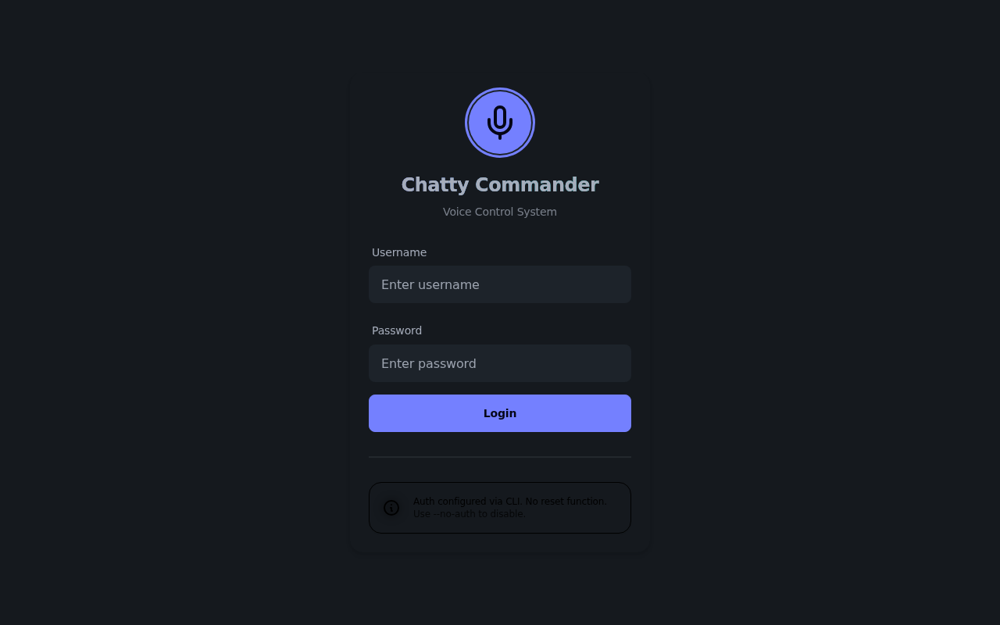
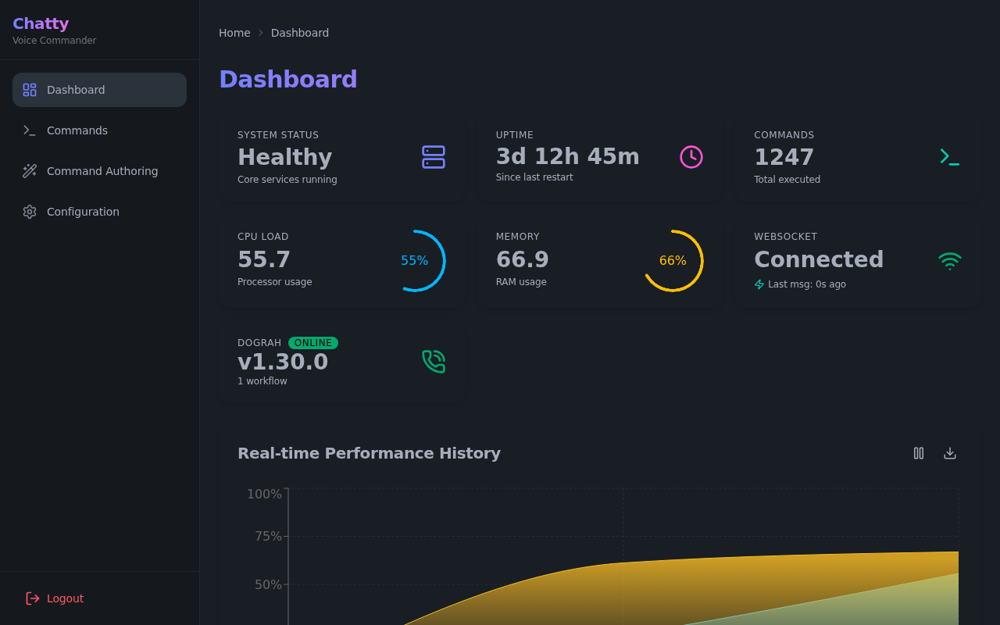
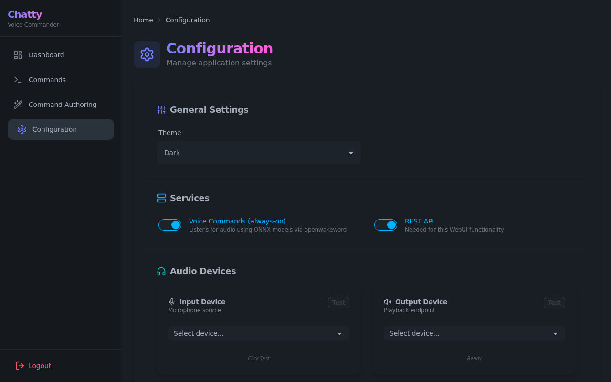
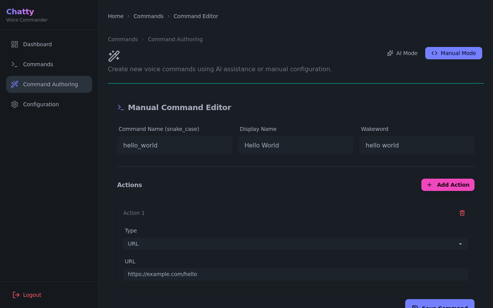
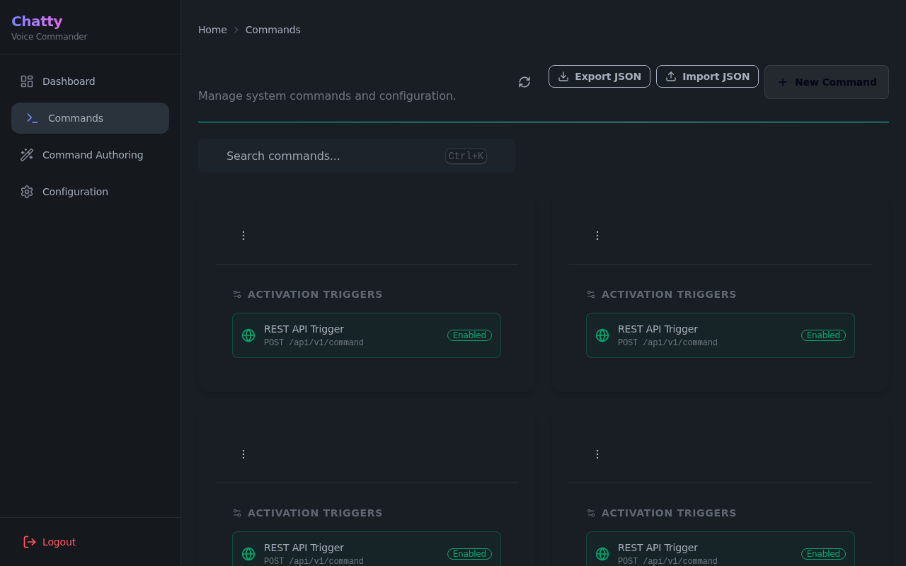
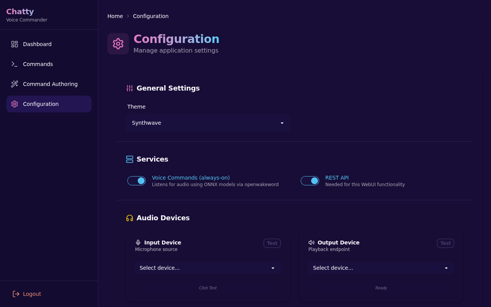
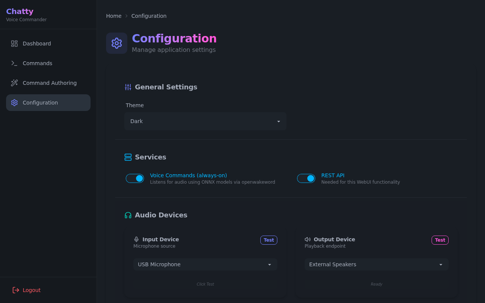
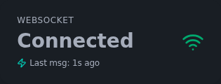

# Guided Tour

A screenshot walkthrough of the full ChattyCommander user story — from logging in to
authoring and firing your first voice command — so you can preview the product before
installing anything.

> All screenshots on this page are generated automatically by
> [`webui/frontend/tests/e2e/guided_tour.spec.ts`](../../webui/frontend/tests/e2e/guided_tour.spec.ts)
> against the backend in `--test-mode` with mocked API data. To regenerate them:
>
> ```bash
> cd webui/frontend
> npm ci && npm run build
> npx playwright install chromium
> npx playwright test tests/e2e/guided_tour.spec.ts
> ```
>
> Playwright starts the backend for you (`uv run python -m chatty_commander.cli.main
> --web --test-mode --port 8100 --no-auth`) and writes the images to `docs/screenshots/`.

## 1. Log in

**What you do:** Open `http://localhost:8100` in a browser after starting
`chatty-commander --web`. With authentication enabled you land on the login card;
credentials are configured via the CLI.

**What you see:** A minimal login form with the ChattyCommander branding.



**Tip:** Running on a trusted machine? Start the server with `--no-auth` and the app
skips this screen entirely, dropping you straight onto the dashboard.

## 2. Land on the dashboard

**What you do:** Log in (or just open the app in `--no-auth` mode).

**What you see:** Live stat cards — system health, uptime, total commands executed,
CPU and memory gauges, the WebSocket connection state, and a Dograh voice-workflow
integration card (here showing `online`, v1.30.0, with one workflow). Below the stats
sit a real-time performance chart and a command log.



**Tip:** The text box under the command log lets you execute any configured command by
name without leaving the dashboard — handy for testing a command you just created.

## 3. Review your configuration

**What you do:** Click **Configuration** in the sidebar.

**What you see:** One page covering general settings (theme), service toggles for
voice commands and the REST API, audio devices, ONNX wake-word models, and the
OpenAI-compatible LLM endpoint used for AI features.



**Tip:** Settings marked `LOCKED BY ENV` are controlled by environment variables on
the server and can't be edited from the UI — useful for locking down API keys.

## 4. Author a command

**What you do:** Click **Command Authoring**, switch to **Manual Mode**, and fill in
the form — here a `hello_world` command with wakeword "hello world" and a single URL
action that opens `https://example.com/hello`.

**What you see:** The manual editor with name, display name, wakeword, and a list of
actions (keypress, URL, shell command, or custom message).



**Tip:** Prefer plain English? **AI Mode** generates the same structure from a
description like "when I say hello world, open my favourite website" — review it,
then save. Either way a confirmation dialog asks you to review actions before saving.

## 5. See it in the commands list

**What you do:** Click **Commands** in the sidebar.

**What you see:** A card per configured command — including the freshly authored
`hello_world` — each showing its activation triggers. Every command is callable via
`POST /api/v1/command` as well as by voice. Search, JSON export/import, edit and
delete live on this page too.



**Tip:** Press `Ctrl+K` anywhere in the app to jump to this page with the search box
focused.

## 6. Make it yours: switch themes

**What you do:** On the Configuration page, pick a different theme — here
**Synthwave**, one of the bundled DaisyUI themes alongside Dark, Light, and Cyberpunk.

**What you see:** The whole UI restyles instantly, no reload needed.



**Tip:** Click **Save Changes** to persist the theme to the backend config so it
survives restarts.

## 7. Pick your microphone and speakers

**What you do:** Still on the Configuration page, choose an input and output device
in the **Audio Devices** section.

**What you see:** Device dropdowns with test buttons — the input card animates a
level meter while testing. (On a machine with no sound hardware the lists are simply
empty.)



**Tip:** The wake-word engine listens on the selected input device, so test the mic
here before wondering why "hey jarvis" goes unheard.

## 8. Watch the live connection

**What you do:** Glance at the **WebSocket** stat card on the dashboard.

**What you see:** A genuine live connection indicator — green `Connected` with the
time since the last message, amber while reconnecting, red when offline.



**Tip:** This is the channel that streams state changes and telemetry to the UI in
real time; if commands seem stale, this card is the first thing to check.

## Ready to try it yourself?

Continue with the [Installation guide](./01_INSTALLATION.md), then dig into
[Configuration](./02_CONFIGURATION.md), the
[Dashboard & WebUI](./03_DASHBOARD_AND_WEBUI.md), and
[Voice Modes & Commands](./04_VOICE_MODES_AND_COMMANDS.md).
