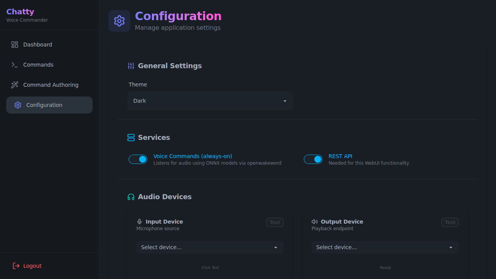
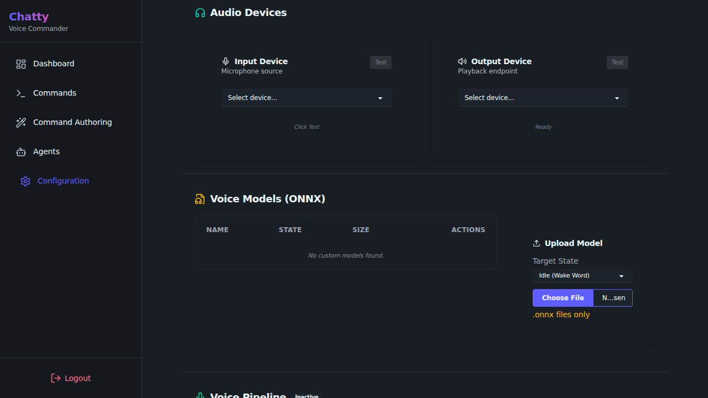
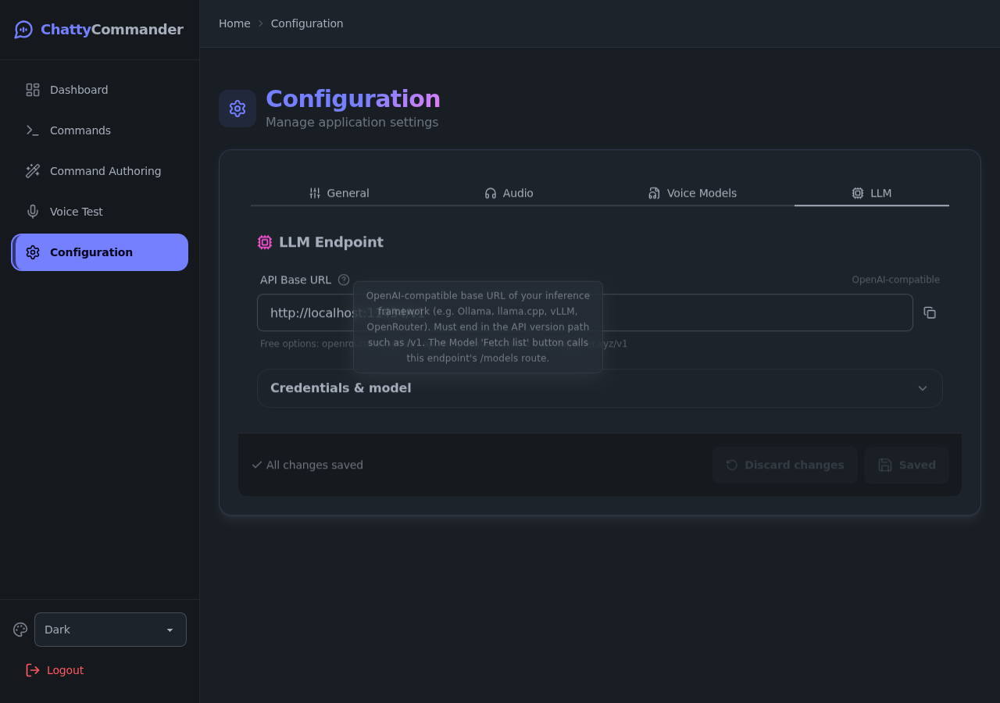

# Configuration Guide

ChattyCommander is highly configurable through two main files: `config.json` and `.env`.

## Setting up API Keys (.env)

Start by copying `.env.example` to `.env`:
```bash
cp .env.example .env
```
Add your OpenAI or compatible LLM credentials here.

## Application Settings (config.json)

The `config.json` file handles application behavior.
You can view sample configurations in `config/`:
- `developer-tools-example.json`
- `full-assistant-example.json`
- `voice-only-example.json`

Saved changes to `config.json` are written atomically (via a temporary file that is then swapped into place), so an interrupted save or crash will not corrupt your configuration.

### Logging Level

Set the `CHATCOMM_LOG_LEVEL` environment variable (`DEBUG`, `INFO`, `WARNING`, or `ERROR`) to control log verbosity when running in web mode. On the command line, the `--log-level` flag takes precedence over this variable.

## Web Dashboard Configuration

Once running, you can modify configuration in real-time using the **Web Dashboard Component**.



### Voice Model Management

You can manage your ONNX voice models directly from the configuration page. This allows you to upload custom wake words or command models without manually accessing the filesystem.



- **Upload Model**: Select a `.onnx` file and choose the target state (Idle, Computer, or Chatty).
- **Delete Model**: Remove unused models to free up space.
- **List Models**: View all available models, their file sizes, and assigned states.

### LLM Settings

Configure your LLM endpoint and model parameters.



### Services

Toggle core services like Voice Commands and REST API on or off.


