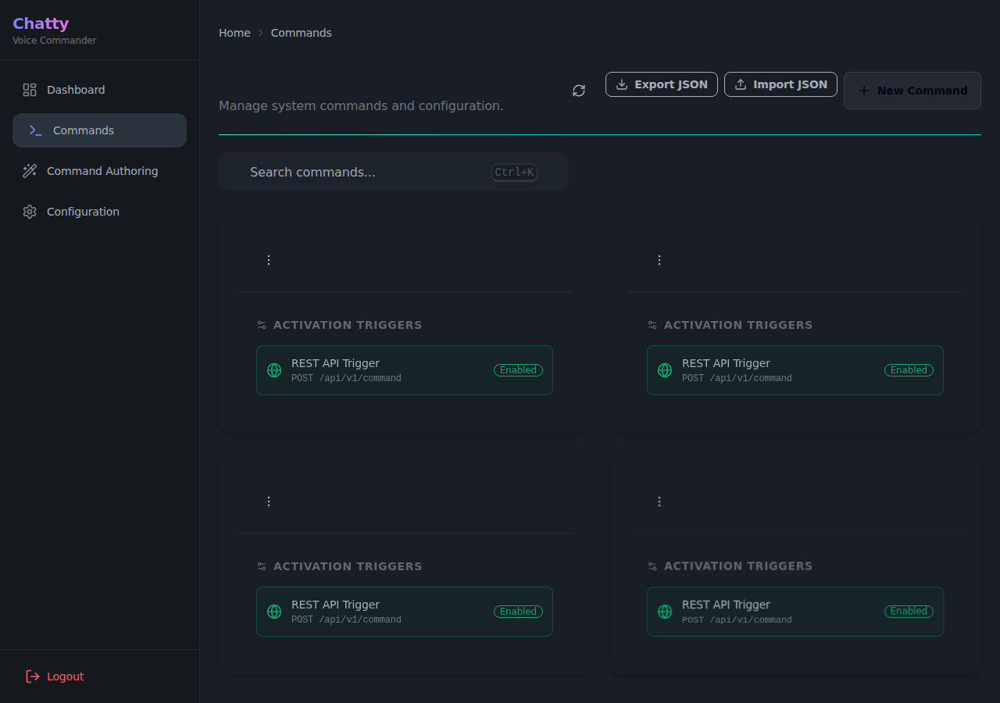

# Voice Modes & Commands

ChattyCommander supports multiple voice interfaces for natural language execution.

## The Wake Word engine
The project currently uses `OpenWakeWord` for robust edge-based active listening.
You can configure the exact model and threshold passing in `config.json`.

## Available States
1. **Idle**: Waiting for the wake word (e.g. "Computer" or "Hey Chatty").
2. **Computer**: Processing a single request and returning to idle.
3. **Chatty**: Keeping the microphone open for sequential commands.

## Custom Voice Commands
You can map specific voice triggers to CLI commands or internal Python functions by modifying the JSON profiles within the backend configs.

The **Commands** page in the WebUI provides a dynamic view of all currently configured commands, their action types (e.g., URL, Keypress), and payloads.
