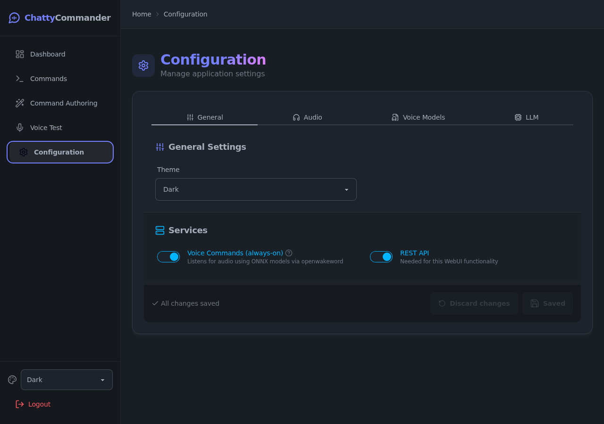
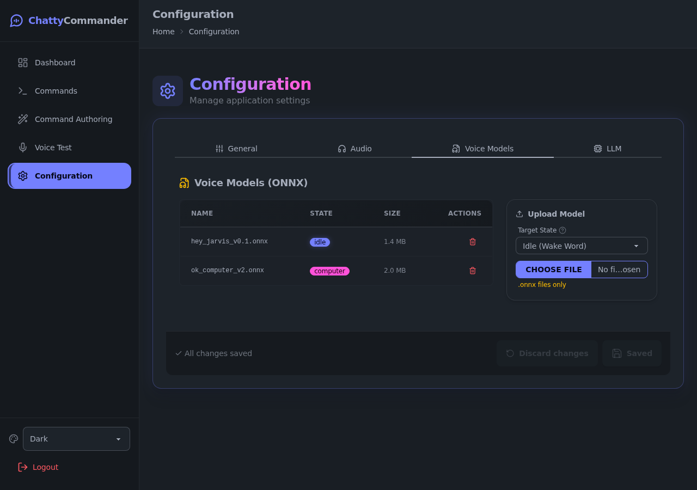
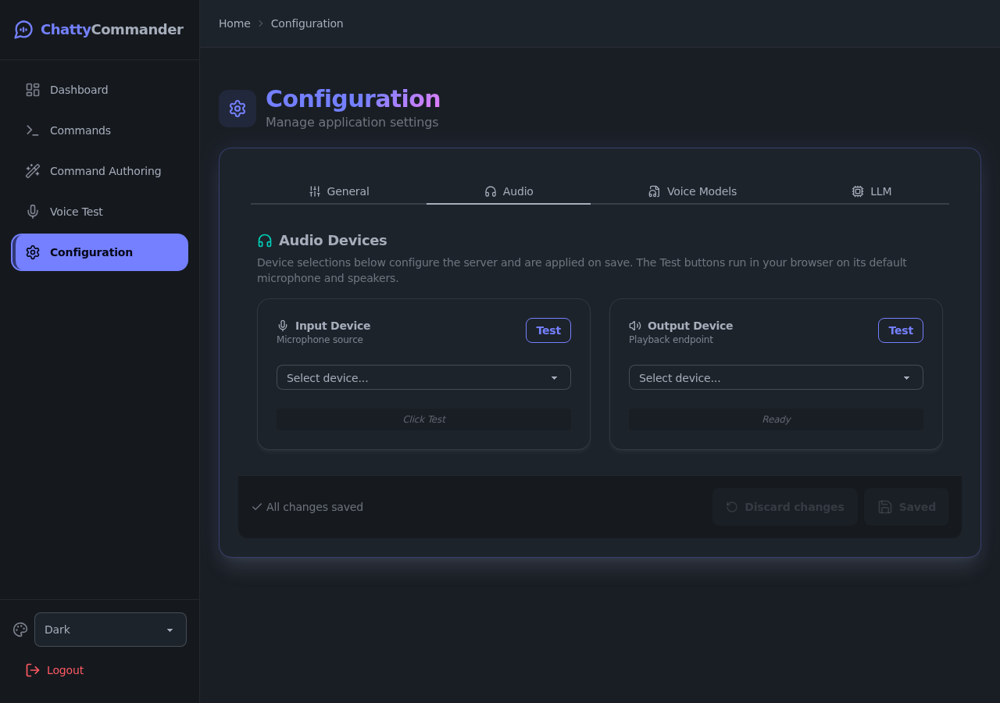
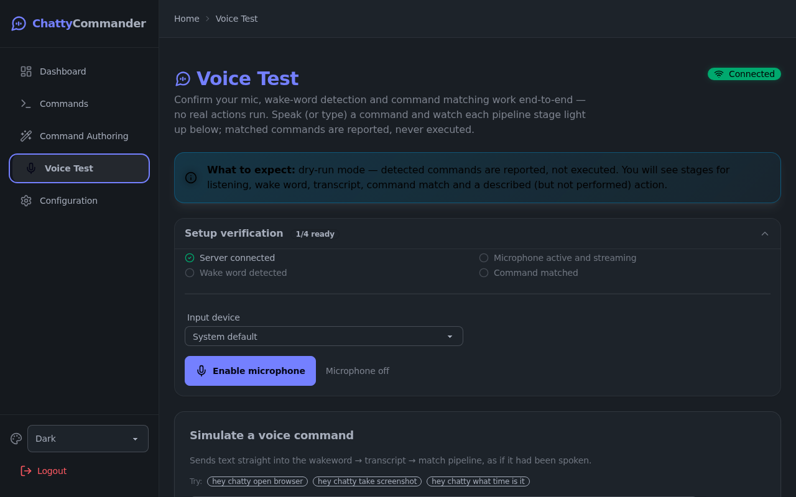

# ChattyCommander User Guide

Everything you need to install, configure, and use ChattyCommander. For a visual
walkthrough with screenshots, start with the [Guided Tour](./00_GUIDED_TOUR.md).

## Installation

**Prerequisites:** Python 3.11+ (Node.js 18+ only for frontend development).

```bash
git clone https://github.com/matthewhand/chatty-commander.git
cd chatty-commander
uv sync                          # fast environment setup
cp config.json.example config.json
uv run chatty-commander          # start the CLI
uv run chatty-commander --web --no-auth   # or start the web dashboard (dev mode)
```

`--no-auth` is a development bypass: it disables API authentication and refuses
to run when `CHATTY_ENV=production` is set.

### Logging

Control verbosity with `--log-level` (`DEBUG`, `INFO`, `WARNING`, `ERROR`):

```bash
uv run chatty-commander --log-level DEBUG
```

In web mode the `CHATCOMM_LOG_LEVEL` environment variable is also honoured
(the CLI flag takes precedence). Set `LOG_FORMAT=json` for structured JSON logs.

## Configuration

ChattyCommander is configured through two files: `config.json` (application
behaviour) and `.env` (credentials and environment overrides).

### Environment variables (.env)

```bash
cp .env.example .env
```

Nothing in `.env` is required to boot with the default config. A variable only
becomes required when you enable the feature that needs it (e.g. an OpenAI key
for advisors, dograh credentials for voice-call actions) — startup then fails
fast listing every missing variable. `.env.example` documents them all.

### Application settings (config.json)

Sample configurations live in `config/`:

- `developer-tools-example.json`
- `full-assistant-example.json`
- `voice-only-example.json`

Saves are atomic (written to a temporary file, then swapped into place), so an
interrupted save cannot corrupt your configuration.

### Configuring from the web dashboard

Once running, the **Configuration** page edits settings in real time:



- **Voice model management** — upload custom `.onnx` wake-word models, assign
  them to a state (Idle, Computer, Chatty), list and delete them, all without
  touching the filesystem:

  

- **LLM settings** — point the advisors at any OpenAI-compatible endpoint. Set
  the base URL up front; the API key and model live under a "Credentials & model"
  disclosure (expanded automatically when either is already set or env-locked):

  

- **Audio** — select input/output devices:

  

- **Services** — toggle core services like voice commands and the REST API.

## The dashboard

The WebUI (React + Vite) is served at `http://localhost:8100/` when running in
web mode. The frontend must be pre-built (`npm run build` in `webui/frontend`);
the server does not build it at startup.

- **Real-time metrics** — CPU, memory, and total commands executed.
- **WebSocket streaming** — state transitions, logs, and errors stream live to
  the UI; the WebSocket stat card shows connection health at a glance.
- **Configuration hot-reload** — settings changes apply without a restart.
- **dograh status card** — reachability and version of the optional
  voice-call engine.

See the [Guided Tour](./00_GUIDED_TOUR.md) for a page-by-page walkthrough.

## Voice modes & commands

### The wake-word engine

ChattyCommander uses `OpenWakeWord` for edge-based active listening. The model
and threshold are set in `config.json`.

### States

1. **Idle** — waiting for a wake word (e.g. "Computer" or "Hey Chatty").
2. **Computer** — processes a single request, then returns to idle.
3. **Chatty** — keeps the microphone open for sequential commands.

### Custom commands

Map voice triggers to actions (keypress, URL, shell command, dograh voice call)
in `config.json` — or use the **Command Authoring** page in the dashboard.

### CLI: list and run commands

```bash
chatty-commander list              # all configured commands
chatty-commander list --json       # machine-readable, actions classified by type
chatty-commander exec <command>    # run a command by name
chatty-commander exec <command> --timeout <seconds>   # abort on overrun (exit 1)
```

The module entry point behaves identically:
`python -m chatty_commander.cli.main list`.

### Testing your voice pipeline from the browser

The **Voice Test** page in the dashboard exercises the real
wakeword → transcript → command-matching pipeline in dry-run mode: enable the
microphone (or type into "Simulate a voice command") and watch each pipeline
stage report live, including the action that *would* have run. Dry-run is the
only mode — nothing executes, so it is always safe to experiment.



## Optional: dograh voice calls

See the [README's dograh section](../../README.md#optional-dograh-voice-call-integration)
for enabling the self-hosted voice-call engine (compose overlay, `.env` block,
`chatty-commander dograh` CLI).
